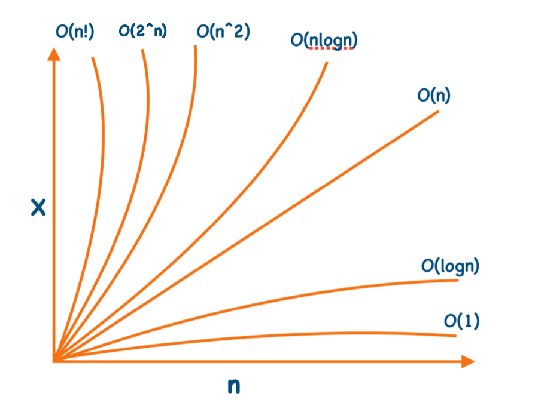

# 📚 Data Structure and Algorithms 🚀

Welcome to the **Data-Structure-and-Algorithms** repository!

This repository contains implementations of popular **Data Structures** 🏗️ and **Algorithms** ⚡ in **C** and **C++**. Each implementation includes clean code, comments, and the **time & space complexities** to help you understand not only *how* an algorithm works, but also *how efficient* it is.

---

# ✨ Features

- ✅ Well-structured implementations
- ✅ Beginner-friendly code
- ✅ Covers basic to advanced DSA topics
- ✅ Time & Space Complexity included
- ✅ Clean and commented source code
- ✅ Interview-focused examples

---

# 🛠️ Topics Covered

## 📊 Time Complexity (Detailed Explanation)

Time complexity is used to measure how the runtime of an algorithm increases as the input size **n** grows. It helps us evaluate how efficient an algorithm is before actually implementing it.

Instead of measuring real execution time, we focus on how the number of operations grows with input size.

## 📊 Time Complexity Overview

Time complexity is a way to represent how the running time of an algorithm increases as the input size **n** increases. It helps us understand how efficient an algorithm is and compare different approaches.

The graph below shows the growth rate of different common time complexities:

- **O(1)** → Constant time (best performance, does not depend on input size)
- **O(log n)** → Logarithmic time (very efficient, reduces problem size each step)
- **O(n)** → Linear time (grows directly with input size)
- **O(n log n)** → Efficient sorting algorithms (Merge Sort, Quick Sort average case)
- **O(n²)** → Quadratic time (nested loops, slower for large inputs)
- **O(2ⁿ)** → Exponential time (very slow, recursive brute-force problems)
- **O(n!)** → Factorial time (extremely slow, permutation problems)

---

## 📌 Key Insight

- Lower curves = better performance 🚀  
- Higher curves = slower algorithms ⚠️  
- Efficient algorithms aim for **O(n)** or **O(n log n)** complexity

---

## 📈 Visualization



---

## 🎯 Why This Matters

Understanding time complexity helps in:
- Writing optimized code
- Cracking coding interviews
- Choosing the right data structure/algorithm
- Improving problem-solving speed


---

## 📦 Arrays

### Topics
- 1D Array
- 2D Array
- Matrix Operations
- Kadane's Algorithm

| Operation | Time Complexity | Space Complexity |
|-----------|-----------------|------------------|
| Traversal | **O(n)** | O(1) |
| Insertion (End) | **O(1)** | O(1) |
| Insertion (Middle) | **O(n)** | O(1) |
| Deletion | **O(n)** | O(1) |
| Searching (Linear) | **O(n)** | O(1) |
| Kadane's Algorithm | **O(n)** | O(1) |

---


## 💾 Dynamic Memory Allocation (DMA)

### Topics
- malloc()
- calloc()
- realloc()
- free()

| Function | Time Complexity |
|----------|-----------------|
| malloc() | O(1) Average |
| calloc() | O(n) |
| realloc() | O(n) Worst |
| free() | O(1) |

---

## 🔗 Linked List (Singly Linked List)

### Topics
- Creation
- Traversal
- Insertion
- Deletion

| Operation | Time Complexity | Space Complexity |
|-----------|-----------------|------------------|
| Traversal | **O(n)** | O(1) |
| Search | **O(n)** | O(1) |
| Insert at Beginning | **O(1)** | O(1) |
| Insert at End | **O(n)** | O(1) |
| Insert at Position | **O(n)** | O(1) |
| Delete Beginning | **O(1)** | O(1) |
| Delete End | **O(n)** | O(1) |
| Delete Position | **O(n)** | O(1) |

---

## 📚 Stack

### Topics
- Stack using Array
- Stack using Linked List

| Operation | Time Complexity | Space Complexity |
|-----------|-----------------|------------------|
| Push | **O(1)** | O(1) |
| Pop | **O(1)** | O(1) |
| Peek | **O(1)** | O(1) |
| Search | **O(n)** | O(1) |

---

## 🏢 Queue

A **Queue** is a linear data structure that follows the **FIFO (First In First Out)** principle. Elements are inserted from the rear and removed from the front.

---

## 📌 Types of Queue
- Simple Queue
- Circular Queue
- Deque (Double Ended Queue)
- Priority Queue

---

## 📊 Queue Implementations

### Using Array

| Operation | Time Complexity | Space Complexity |
|-----------|----------------|------------------|
| Enqueue | **O(1)** | O(1) |
| Dequeue | **O(1)** | O(1) |
| Front Access | **O(1)** | O(1) |
| Rear Access | **O(1)** | O(1) |

---

### Using Linked List

| Operation | Time Complexity | Space Complexity |
|-----------|----------------|------------------|
| Enqueue (Rear) | **O(1)** | O(1) |
| Dequeue (Front) | **O(1)** | O(1) |
| Front Access | **O(1)** | O(1) |

---

## 🔄 Circular Queue

A circular queue optimizes space by connecting the last position back to the first.

| Operation | Time Complexity | Space Complexity |
|-----------|----------------|------------------|
| Enqueue | **O(1)** | O(1) |
| Dequeue | **O(1)** | O(1) |

---

## ⚡ Priority Queue

A priority queue removes elements based on priority (not FIFO).

| Operation | Time Complexity |
|-----------|-----------------|
| Insertion | **O(log n)** |
| Deletion (Highest Priority) | **O(log n)** |
| Peek | **O(1)** |

---

## 🔍 Deque (Double Ended Queue)

Already supports insertion and deletion from both ends.

| Operation | Time Complexity |
|-----------|-----------------|
| Insert Front | **O(1)** |
| Insert Rear | **O(1)** |
| Delete Front | **O(1)** |
| Delete Rear | **O(1)** |

---

## 📌 Applications of Queue

- CPU Scheduling
- Breadth First Search (BFS)
- Print Queue Management
- Producer-Consumer Problems
- Network Packet Handling
- Task Scheduling

---

## 🌳 Binary Tree

### Topics
- Binary Tree Creation
- Traversals

| Operation | Time Complexity | Space Complexity |
|-----------|-----------------|------------------|
| Inorder Traversal | **O(n)** | O(h) |
| Preorder Traversal | **O(n)** | O(h) |
| Postorder Traversal | **O(n)** | O(h) |
| Level Order | **O(n)** | O(n) |

> **h = Height of the Tree**

---

## 🌲 Binary Search Tree (BST)

### Topics
- Creation
- Insertion
- Searching
- Deletion

| Operation | Average | Worst |
|-----------|---------|-------|
| Search | **O(log n)** | O(n) |
| Insert | **O(log n)** | O(n) |
| Delete | **O(log n)** | O(n) |

Space Complexity: **O(h)**

---

## 🌳 Red-Black Tree

### Topics
- Insertion
- Deletion
- Searching

| Operation | Time Complexity |
|-----------|-----------------|
| Search | **O(log n)** |
| Insert | **O(log n)** |
| Delete | **O(log n)** |

Space Complexity: **O(n)**

---


## 🕸️ Graph

### Topics
- Graph Representation (Adjacency Matrix, Adjacency List)
- Breadth First Search (BFS)
- Depth First Search (DFS)
- Weighted Graphs
- Directed & Undirected Graphs
- Shortest Path (Dijkstra’s Algorithm, Bellman-Ford)
- Minimum Spanning Tree (Prim’s, Kruskal’s)

---

### 📊 Graph Representations

| Representation | Time Complexity | Space Complexity |
|----------------|----------------|------------------|
| Adjacency Matrix (Create) | **O(V²)** | **O(V²)** |
| Adjacency List (Create) | **O(V + E)** | **O(V + E)** |
| Check Edge (Matrix) | **O(1)** | - |
| Check Edge (List) | **O(V)** | - |

---

## 🔍 Traversals

### Breadth First Search (BFS)

| Complexity | Value |
|------------|-------|
| Time | **O(V + E)** |
| Space | **O(V)** |

---

### Depth First Search (DFS)

| Complexity | Value |
|------------|-------|
| Time | **O(V + E)** |
| Space | **O(V)** |

---

## 🧭 Shortest Path Algorithms

### Dijkstra’s Algorithm

| Complexity | Value |
|------------|-------|
| Time (Binary Heap) | **O((V + E) log V)** |
| Time (Array) | **O(V²)** |
| Space | **O(V)** |

---

### Bellman-Ford Algorithm

| Complexity | Value |
|------------|-------|
| Time | **O(V × E)** |
| Space | **O(V)** |

---

## 🌳 Minimum Spanning Tree (MST)

### Prim’s Algorithm

| Complexity | Value |
|------------|-------|
| Time (Heap) | **O(E log V)** |
| Time (Matrix) | **O(V²)** |
| Space | **O(V)** |

---

### Kruskal’s Algorithm

| Complexity | Value |
|------------|-------|
| Time | **O(E log E)** |
| Space | **O(V)** |

---

## 📌 Graph Key Points

- Graph can be **Directed / Undirected**
- Can be **Weighted / Unweighted**
- Can be **Cyclic / Acyclic**
- BFS → Best for **shortest path in unweighted graphs**
- DFS → Best for **cycle detection, backtracking, connectivity**
- Dijkstra → Works only for **non-negative weights**
- Bellman-Ford → Works with **negative weights**

# ⚡ Algorithms

## 🔍 Searching Algorithms

### Linear Search

| Complexity | Value |
|------------|-------|
| Best | **O(1)** |
| Average | **O(n)** |
| Worst | **O(n)** |
| Space | **O(1)** |

---

### Binary Search

| Complexity | Value |
|------------|-------|
| Best | **O(1)** |
| Average | **O(log n)** |
| Worst | **O(log n)** |
| Space | **O(1)** (Iterative) |

---

## ↕️ Sorting Algorithms

| Algorithm | Best | Average | Worst | Space |
|-----------|------|----------|--------|-------|
| Bubble Sort | O(n) | O(n²) | O(n²) | O(1) |
| Insertion Sort | O(n) | O(n²) | O(n²) | O(1) |
| Merge Sort | O(n log n) | O(n log n) | O(n log n) | O(n) |
| Quick Sort | O(n log n) | O(n log n) | O(n²) | O(log n) |

---

## 🧩 Backtracking

### N-Queens Problem

| Complexity | Value |
|------------|-------|
| Time | **O(N!)** |
| Space | **O(N)** |

---

## 🧵 String Algorithms

### KMP Algorithm

| Complexity | Value |
|------------|-------|
| Time | **O(n + m)** |
| Space | **O(m)** |

---

### Rabin-Karp Algorithm

| Complexity | Value |
|------------|-------|
| Average | **O(n + m)** |
| Worst | **O(nm)** |
| Space | **O(1)** |

---

## 🔄 Recursion

### Factorial

| Time | Space |
|------|-------|
| **O(n)** | **O(n)** |

### Fibonacci (Recursive)

| Time | Space |
|------|-------|
| **O(2ⁿ)** | **O(n)** |

### Tower of Hanoi

| Time | Space |
|------|-------|
| **O(2ⁿ)** | **O(n)** |

---

## 🪟 Sliding Window

### Fixed / Variable Window Problems

| Complexity | Value |
|------------|-------|
| Time | **O(n)** |
| Space | **O(1)** |

---

# 📂 Directory Structure

| Directory | Description |
|-----------|-------------|
| **Array/** | Array operations, Matrix operations, Kadane's Algorithm |
| **Backtracking/** | N-Queens implementation |
| **Binary Tree/** | Binary Tree creation and traversals |
| **Binary_search_tree/** | BST insertion, deletion and searching |
| **DMA/** | Dynamic Memory Allocation examples |
| **Linked_List/** | Singly Linked List implementation |
| **Recursion/** | Factorial, Fibonacci and Tower of Hanoi |
| **Red_Black_Tree/** | Red-Black Tree implementation |
| **Searching/** | Linear Search and Binary Search |
| **Sliding_Window/** | Sliding Window problems |
| **Sorting/** | Bubble, Insertion, Merge and Quick Sort |
| **Stack/** | Stack implementation |
| **String/** | KMP, Rabin-Karp and string operations |
| **Tree_Traversal/** | Inorder, Preorder and Postorder traversal |

---

# 🚀 Getting Started

### Clone the Repository

```bash
git clone https://github.com/your-username/Data-Structure-and-Algorithms.git
cd Data-Structure-and-Algorithms
```

### Compile C Programs

```bash
gcc Sorting/Bubble_sort.c -o output
./output
```

### Compile C++ Programs

```bash
g++ Array/2D_Array.cpp -o output
./output
```

---

# 🎯 Purpose

- 📘 Learn Data Structures from scratch
- ⚡ Understand Algorithm Analysis
- 🏆 Prepare for Coding Interviews
- 💻 Practice Competitive Programming
- 🎓 Build strong Computer Science fundamentals

---

# 🤝 Contributing

Contributions are welcome!

1. Fork the repository 🍴
2. Create a feature branch 🌿
3. Commit your changes 💡
4. Push your branch 🚀
5. Open a Pull Request 🔥

---

# ⭐ Support

If you found this repository helpful, consider giving it a **⭐ Star**. It helps others discover the project and motivates future improvements.


## 📬 Contact

If you want to connect, collaborate, or discuss DSA / development topics, feel free to reach out:

- 📧 Email: **subhasishjena8280@gmail.com**

- 🔗 LinkedIn: [Subhasish Jena](https://www.linkedin.com/in/jena-subhasish-290702270/)

- 🧠 LeetCode: [SubhasishJena_55](https://leetcode.com/u/SubhasishJena_55/)

---
